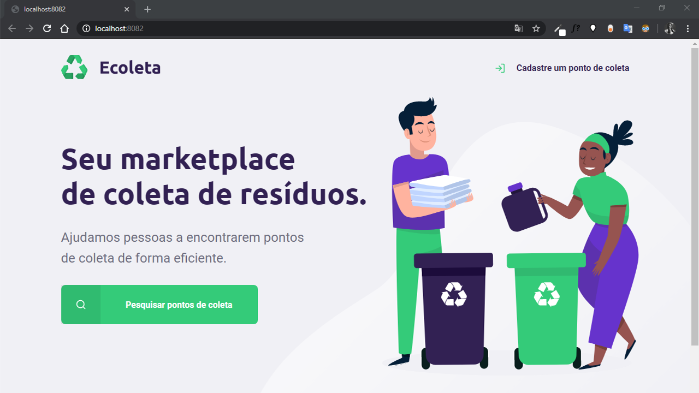

<p align="center">
   <a target="_blank" rel="Ecoleta" href="https://github.com/Rocketseat"></a><br>
</p>
<h1>Next Level Week</h1> 
<blockquote>O NLW é uma semana prática com muito código, desafios e networking desenvolvido pela RocketSeat.</blockquote>

<p align="center">
   <a target="_blank" rel="Ecoleta" href="https://github.com/Rocketseat"></a><br>
</p>

## 💚 Guia de conteúdo

<li><a href="#recursos">Recursos</a></li><br>
<li><a href="#instalacao">Instalação</a></li><br>
<li><a href="#como-comecar">Como começar?</a></li><br>
<li><a href="#faq">FAQ</a></li><br>
<li><a href="#licenca">Licença</a></li><br>

## <a id="recursos"></a>♻️ Recursos

✅ Pesquise os pontos de coleta para poder deixar os resíduos de acordo com o perfil do resíduo.<br>

✅ Cadastre o ponto de coleta de resíduos da sua empresa.<br>

✅ A empresa avisa com antecedência quais tipos de resíduos a ser coletado.<br>

## <a id="instalacao"></a> 🚧 Instalação

Verifique se você possui o [Node.js](https://nodejs.org/en/download/) instalado, pois ele contém o <b>npm</b>, necessário para instalar dependências, iniciar os scripts apropriados e gerar a build do projeto.

Clone o repositório:
````
git clone https://github.com/merciakeila/NextLevelWeek
````
Instale as dependências necessárias para este projeto:

````
npm install
````

Os arquivos da build podem ser gerados da seguinte maneira:

````
npm run build
````
## <a id="como-comecar"></a> 🏁 Como começar?

<b> Executando o projeto</b>

Inicie o ambiente de desenvolvimento, em seguida,  navegue em um navegador para o endereço (http: // localhost: 8080):

````
npm run start
````
## <a id="faq"></a> 💬 FAQ

<b>Pergunta:</b> Sobre o que é o projeto?

<b>Resposta:</b> O NLW é uma semana prática com muito código, desafios e networking desenvolvido pela RocketSeat. O Ecoleta é um projeto dedicado ao dia do meio ambiente, com o objetivo de ajudar as pessoas encontrar pontos de coleta de resíduos ou cadastrar os próprios pontos.

<b>Pergunta:</b> Quais são as tecnologias usadas neste projeto?

<b>Resposta:</b> As tecnologias usadas neste projeto são...

✅ HTML 5 <br>
✅ CSS 3<br>
- Pré-processador SASS/SCSS
- ITCSS significa triângulo invertido CSS, e ajuda você a fazer o projeto CSS escalável e sustentável.
- Metodologia RSCSS.<br>

✅ JavaScipt
- Webpack

## <a id="licenca"></a> 🍏 Licença

Released in 2020. This project is under the [MIT license](https://nodejs.org/en/download/) 
<br>
<br>
🚀 Desenvolvido por Mércia Keila
 
